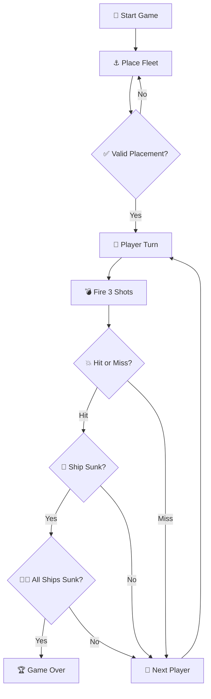

# Battleship Project

(Perguntas Teóricas)
Pergunta 1 — Pull request, merge e o grafo

Pergunta: Veja o que aconteceu no grafo… comente o que viu no grafo, isto é, o que resultou do pull request e do merge.
Resposta: (a tua resposta atual, mas já formatada corrido e limpa)
No grafo de rede vê-se que o ramo do pull request foi criado a partir do main, ficando a linha do main e a linha do ramo separadas a partir de um certo commit; depois aparecem commits feitos no ramo do PR em paralelo, até que, quando o pull request é processado e feito o merge, as duas linhas voltam a convergir no main, normalmente através de um merge commit. O resultado é que as alterações do ramo do PR passam a fazer parte do histórico do main.

Pergunta 2 — Product Owner e Product Backlog

Pergunta: Considere que é o Product Owner dessa app. Que requisitos adicionais lhe faltam? Qual deverá ser o Product Backlog?
Resposta: (a tua resposta, mas ligeiramente mais “backlog” e menos “explicativa”)
Para além do básico, o backlog deve incluir: validações na colocação da frota (sem sobreposição, sem contacto, apenas horizontal/vertical e dentro do tabuleiro), gestão do turno com a regra dos 3 tiros, validação de jogadas (sem tiros repetidos/fora do tabuleiro), deteção de navios afundados e fim de jogo, visualização correta (tabuleiro próprio completo e do adversário apenas com acertos/água), persistência consistente em JSON (guardar e retomar), e melhorias de usabilidade (mensagens claras/ajuda, e opcionalmente IA e estatísticas).

Pergunta 3 — GitHub Issues no Scrum (assumir, concluir, desistir)

Pergunta: Na daily escolhe uma user story. O que fazer no GitHub? E depois para indicar implementada? E se o PO desistir?
Resposta:
Para assumir uma user story, seleciona-se uma issue aberta e regista-se um comentário na própria issue a indicar que foi assumida (e atribui-se ao respetivo elemento, se usarem assignees). Quando estiver concluída, volta-se à issue e comenta-se que foi implementada, referindo o pull request/commit, e a issue é fechada após o merge (ou manualmente). Se o PO desistir, regista-se a decisão com um comentário na issue e fecha-se a issue para assinalar que foi cancelada/adiada.

Pergunta 4 — Web vs IDE

Pergunta: Diferenças entre trabalhar via web e via IDE? Em que situações é preferível cada abordagem?
Resposta:
Via web (GitHub) é mais adequado para coordenação e colaboração: gestão de issues, acompanhamento do trabalho, discussão e code review em pull requests. Via IDE é mais adequado para desenvolvimento: escrever/refatorar código, correr e depurar, executar testes e resolver conflitos de merge, sendo preferível para alterações maiores antes de submeter um PR.
---

## 🌊 Índice
- [Tripulação](#-tripulação)
- [Jogo e regras](#-jogo-e-regras)
- [Logic Flow](#-logic-flow)

___

## 🚣 Tripulação

### **Nome da embarcação:**  MidnightFleet

| Curso | Número | Nome |
|------|--------|------|
| LIGE-PL | 112967 | Gabriel Matos |
| LIGE-PL | 124423 | David Costa |
| LIGE-PL | 122477 | Maria Frade |
| LIGE-PL | 111111 | João Nicolau |

___

## 🎮 Jogo e Regras

Projeto de implementação do jogo "Batalha Naval" no âmbito da unidade curricular Engenharia de Software.

O objetivo é afundar toda a frota inimiga antes do adversário.

### Frota Disponível

| Navio       | Nome (EN) | Tamanho | Quantidade |
| ----------- | --------- | ------- | ---------- |
| 🛳 Galeão    | Galleon  | 5       | 1          |
| ⛵ Fragata  | Frigate   | 4       | 1          |
| 🚢 Nau      | Carrack   | 3       | 2          |
| 🚤 Caravela | Caravel   | 2       | 3          |
| 🛶 Barca    | Barge     | 1       | 4          |

### KeyFeatures

| Feature               | Description                                                                                   | Status         |
| --------------------- | --------------------------------------------------------------------------------------------- | -------------- |
| 🧩 **Grid System**    | Flexible **N×N board generation**, allowing customizable game sizes.                          | ✅ Completed    |
| 🚢 **Ship Varieties** | Includes **Galleons, Frigates, and Brigantines**, inspired by a **17th-century naval theme**. | ✅ Completed    |
| 🤖 **AI Opponent**    | **Heuristic-based targeting system** for smarter enemy attacks.                               | 🚧 In Progress |
| 🌐 **Network Play**   | **Socket-based multiplayer** support for playing over a network.                              | ❌ Planned      |

### Logic Flow
<!-- meter regras -->

### ⚓ Logic Flow

---
