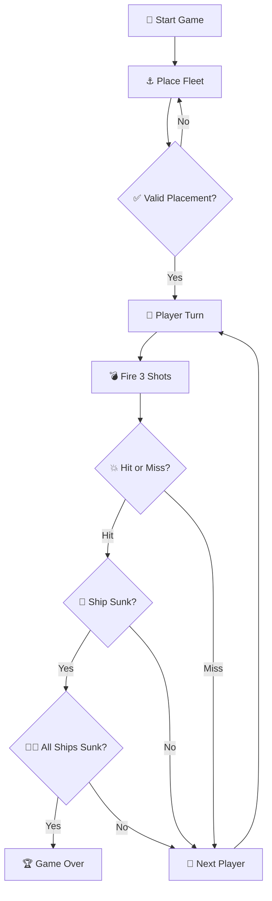

# Battleship Project

---

## 🌊 Índice
- [Tripulação](#-tripulação)
- [Jogo e regras](#-jogo-e-regras)
- [Frota Disponível](#-frota-disponível)
- [Logic Flow](#-logic-flow)

___

## 🚣 Tripulação

### **Nome da embarcação:**  MidnightFleet

| Curso | Número | Nome |
|------|--------|------|
| LIGE-PL | 112967 | Gabriel Matos |
| LIGE-PL | 124423 | David Costa |
| LIGE-PL | 122477 | Maria Frade |
| LIGE-PL | 111111 | João Nicolau |

___

## 🎮 Jogo e Regras

Projeto de implementação do jogo "Batalha Naval" no âmbito da unidade curricular Engenharia de Software.

O objetivo é afundar toda a frota inimiga antes do adversário.

| Navio       | Nome (EN) | Tamanho | Quantidade |
| ----------- | --------- | ------- | ---------- |
| 🛳 Galeão    | Galleon  | 5       | 1          |
| ⛵ Fragata  | Frigate   | 4       | 1          |
| 🚢 Nau      | Carrack   | 3       | 2          |
| 🚤 Caravela | Caravel   | 2       | 3          |
| 🛶 Barca    | Barge     | 1       | 5          |

<!-- meter regras -->

### ⚓ Logic Flow

---
