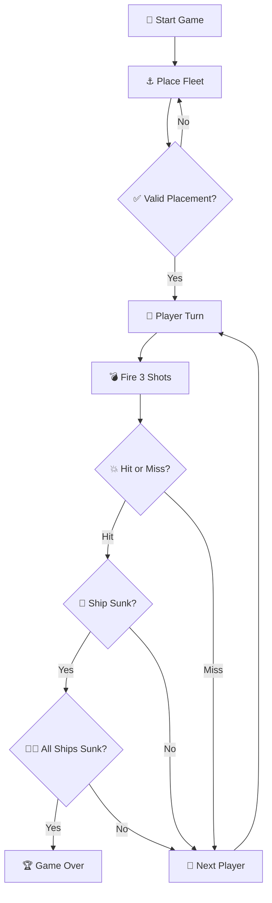

# Battleship Project

## Grupo

**Nickname do grupo:**  MidnightFleet

---

## Membros do Grupo

| Curso | Número | Nome |
|------|--------|------|
| LIGE-PL | 112967 | Gabriel Matos |
| LIGE-PL | 124423 | David Costa |
| LIGE-PL | 122477 | Maria Frade |
| LIGE-PL | 111111 | João Nicolau |

---

## Descrição

Projeto de implementação do jogo Battleship no âmbito da unidade curricular engenharia de software.

### Logic Flow

---
