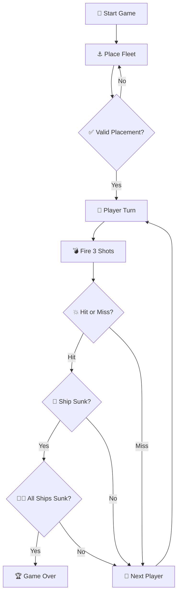

# Battleship Project

(Domande Teoriche)
Domanda 1 — Pull request, merge e il grafo

Domanda:
Osserva ciò che è accaduto nel grafo… commenta ciò che hai visto nel grafo, cioè il risultato della pull request e del merge.

Risposta:
Nel grafo della rete si vede che il ramo della pull request è stato creato a partire dal main, lasciando la linea del main e quella del ramo separate a partire da un certo commit; successivamente compaiono commit effettuati nel ramo della PR in parallelo, finché, quando la pull request viene elaborata ed eseguito il merge, le due linee tornano a convergere nel main, normalmente attraverso un merge commit.
Il risultato è che le modifiche del ramo della PR diventano parte della cronologia del main.

Domanda 2 — Product Owner e Product Backlog

Domanda:
Considera di essere il Product Owner di questa applicazione. Quali requisiti aggiuntivi mancano? Quale dovrebbe essere il Product Backlog?

Risposta:
Oltre alle funzionalità di base, il backlog dovrebbe includere:

validazioni nel posizionamento della flotta (senza sovrapposizioni, senza contatto tra navi, solo orizzontale/verticale e all’interno della griglia);

gestione del turno con la regola dei 3 colpi;

validazione delle mosse (niente colpi ripetuti o fuori dalla griglia);

rilevamento delle navi affondate e della fine della partita;

visualizzazione corretta (la propria griglia completa e quella dell’avversario solo con colpi riusciti o acqua);

persistenza coerente in JSON (salvare e riprendere la partita);

miglioramenti di usabilità (messaggi chiari, aiuto per il giocatore, e opzionalmente IA e statistiche).

Domanda 3 — GitHub Issues nello Scrum (assumere, completare, abbandonare)

Domanda:
Durante la daily scegli una user story. Cosa fare su GitHub? E poi come indicare che è stata implementata? E se il PO decidesse di abbandonarla?

Risposta:
Per assumere una user story si seleziona una issue aperta e si registra un commento nella stessa issue indicando che è stata presa in carico (assegnandola anche al relativo membro del team, se si utilizzano gli assignees).

Quando il lavoro è concluso, si torna alla issue e si aggiunge un commento indicando che è stata implementata, facendo riferimento alla pull request o al commit. L’issue viene poi chiusa dopo il merge (o manualmente).

Se il Product Owner decide di abbandonarla, si registra la decisione con un commento nella issue e la si chiude per indicare che è stata cancellata o rimandata.

Domanda 4 — Web vs IDE

Domanda:
Quali sono le differenze tra lavorare via web e tramite IDE? In quali situazioni è preferibile ciascun approccio?

Risposta:
Lavorare via web (GitHub) è più adatto per il coordinamento e la collaborazione: gestione delle issue, monitoraggio del lavoro, discussione e code review nelle pull request.

Lavorare tramite IDE è più adatto allo sviluppo: scrivere e rifattorizzare codice, eseguire e fare debug del programma, eseguire test e risolvere conflitti di merge. È quindi preferibile per modifiche più consistenti prima di inviare una pull request.
---

## 🌊 Índice
- [Tripulação](#-tripulação)
- [Jogo e regras](#-jogo-e-regras)
- [Logic Flow](#-logic-flow)

___

## 🚣 Tripulação

### **Nome da embarcação:**  MidnightFleet

| Curso | Número | Nome |
|------|--------|------|
| LIGE-PL | 112967 | Gabriel Matos |
| LIGE-PL | 124423 | David Costa |
| LIGE-PL | 122477 | Maria Frade |
| LIGE-PL | 111111 | João Nicolau |

___

## 🎮 Jogo e Regras

Projeto de implementação do jogo "Batalha Naval" no âmbito da unidade curricular Engenharia de Software.

O objetivo é afundar toda a frota inimiga antes do adversário.

### Frota Disponível

| Navio       | Nome (EN) | Tamanho | Quantidade |
| ----------- | --------- | ------- | ---------- |
| 🛳 Galeão    | Galleon  | 5       | 1          |
| ⛵ Fragata  | Frigate   | 4       | 1          |
| 🚢 Nau      | Carrack   | 3       | 2          |
| 🚤 Caravela | Caravel   | 2       | 3          |
| 🛶 Barca    | Barge     | 1       | 4          |

### KeyFeatures

| Feature               | Description                                                                                   | Status         |
| --------------------- | --------------------------------------------------------------------------------------------- | -------------- |
| 🧩 **Grid System**    | Flexible **N×N board generation**, allowing customizable game sizes.                          | ✅ Completed    |
| 🚢 **Ship Varieties** | Includes **Galleons, Frigates, and Brigantines**, inspired by a **17th-century naval theme**. | ✅ Completed    |
| 🤖 **AI Opponent**    | **Heuristic-based targeting system** for smarter enemy attacks.                               | 🚧 In Progress |
| 🌐 **Network Play**   | **Socket-based multiplayer** support for playing over a network.                              | ❌ Planned      |

### Logic Flow
<!-- meter regras -->

### ⚓ Logic Flow

```mermaid
graph TD
    A[🚀 Start Game] --> B[⚓ Place Fleet]
    B --> C{✅ Valid Placement?}
    C -- No --> B
    C -- Yes --> D[🎯 Player Turn]
    D --> E[💣 Fire 3 Shots]
    E --> F{💥 Hit or Miss?}
    F -- Hit --> G{🚢 Ship Sunk?}
    F -- Miss --> H[🔄 Next Player]
    G -- Yes --> I{🏴‍☠️ All Ships Sunk?}
    G -- No --> H
    I -- Yes --> J[🏆 Game Over]
    I -- No --> H
    H --> D
```
---
