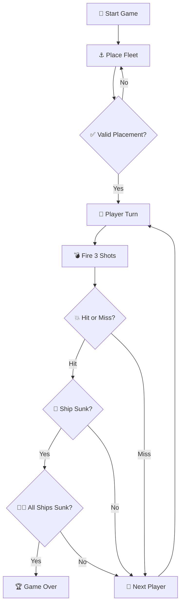

# Battleship Project

(Theoretical Questions)

Question 1 — Pull request, merge, and the graph

Question: Look at what happened in the graph... comment on what you saw in the graph, i.e., what resulted from the pull request and the merge.

Answer:
In the network graph, it is visible that the pull request branch was created from main, with the main line and the branch line diverging after a specific commit. Then, commits made on the PR branch appear in parallel until, when the pull request is processed and the merge is performed, the two lines converge back into main, usually through a merge commit. The result is that the changes from the PR branch become part of the main history.

Question 2 — Product Owner and Product Backlog

Question: Consider you are the Product Owner of this app. What additional requirements are missing? What should the Product Backlog contain?

Answer:
Beyond the basics, the backlog should include: fleet placement validations (no overlap, no adjacency/touching, only horizontal/vertical, and within board limits), turn management with the 3-shot rule, move validation (no repeated shots or out-of-bounds shots), detection of sunken ships and game over conditions, correct visualization (full own board and opponent's board showing only hits/misses), consistent JSON persistence (save and resume game), and usability improvements (clear messages/help, and optionally AI and statistics).

Question 3 — GitHub Issues in Scrum (picking up, completing, dropping)

Question: During the daily meeting, you pick a user story. What do you do on GitHub? And later to indicate it is implemented? And if the PO drops the story?

Answer:
To take on a user story, you select an open issue and post a comment on the issue itself indicating it has been picked up (and assign it to the respective member, if using assignees). When it is completed, you return to the issue and comment that it has been implemented, referencing the pull request/commit hash, and the issue is closed after the merge (or manually). If the PO decides to drop the story, the decision is recorded with a comment on the issue, and the issue is closed to signal it was cancelled/postponed.

Question 4 — Web vs. IDE

Question: Differences between working via the web and via an IDE? In which situations is each approach preferable?

Answer:
Via web (GitHub) is more suitable for coordination and collaboration: issue management, work tracking, discussions, and code reviews in pull requests.  Via IDE is more suitable for actual development: writing/refactoring code, running and debugging, executing tests, and resolving merge conflicts, being preferable for larger changes before submitting a PR.
---

## 🌊 Índice
- [Tripulação](#-tripulação)
- [Jogo e regras](#-jogo-e-regras)
- [Logic Flow](#-logic-flow)

___

## 🚣 Tripulação

### **Nome da embarcação:**  MidnightFleet

| Curso | Número | Nome |
|------|--------|------|
| LIGE-PL | 112967 | Gabriel Matos |
| LIGE-PL | 124423 | David Costa |
| LIGE-PL | 122477 | Maria Frade |
| LIGE-PL | 111111 | João Nicolau |

___

## 🎮 Jogo e Regras

Projeto de implementação do jogo "Batalha Naval" no âmbito da unidade curricular Engenharia de Software.

O objetivo é afundar toda a frota inimiga antes do adversário.

### Frota Disponível

| Navio       | Nome (EN) | Tamanho | Quantidade |
| ----------- | --------- | ------- | ---------- |
| 🛳 Galeão    | Galleon  | 5       | 1          |
| ⛵ Fragata  | Frigate   | 4       | 1          |
| 🚢 Nau      | Carrack   | 3       | 2          |
| 🚤 Caravela | Caravel   | 2       | 3          |
| 🛶 Barca    | Barge     | 1       | 4          |

### KeyFeatures

| Feature               | Description                                                                                   | Status         |
| --------------------- | --------------------------------------------------------------------------------------------- | -------------- |
| 🧩 **Grid System**    | Flexible **N×N board generation**, allowing customizable game sizes.                          | ✅ Completed    |
| 🚢 **Ship Varieties** | Includes **Galleons, Frigates, and Brigantines**, inspired by a **17th-century naval theme**. | ✅ Completed    |
| 🤖 **AI Opponent**    | **Heuristic-based targeting system** for smarter enemy attacks.                               | 🚧 In Progress |
| 🌐 **Network Play**   | **Socket-based multiplayer** support for playing over a network.                              | ❌ Planned      |

### Logic Flow
<!-- meter regras -->

### ⚓ Logic Flow

```mermaid
graph TD
    A[🚀 Start Game] --> B[⚓ Place Fleet]
    B --> C{✅ Valid Placement?}
    C -- No --> B
    C -- Yes --> D[🎯 Player Turn]
    D --> E[💣 Fire 3 Shots]
    E --> F{💥 Hit or Miss?}
    F -- Hit --> G{🚢 Ship Sunk?}
    F -- Miss --> H[🔄 Next Player]
    G -- Yes --> I{🏴‍☠️ All Ships Sunk?}
    G -- No --> H
    I -- Yes --> J[🏆 Game Over]
    I -- No --> H
    H --> D
```
---
