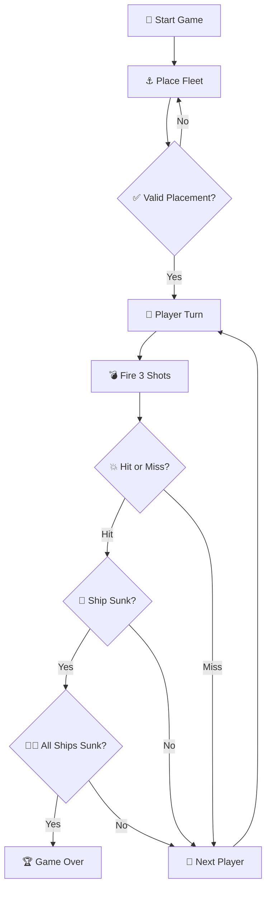

# Battleship Project

Teste para Pratique os comandos: git init, clone, add, commit, push, pull

(Preguntas Teóricas)

Pregunta 1 — Pull request, merge y el grafo

Pregunta: Observe lo que ocurrió en el grafo… comente lo que vio en el grafo, es decir, qué resultó del pull request y del merge.

Respuesta:
En el grafo de red se ve que la rama del pull request fue creada a partir de main, quedando la línea de main y la línea de la rama separadas a partir de un determinado commit; después aparecen commits realizados en la rama del PR en paralelo, hasta que, cuando el pull request es procesado y se hace el merge, las dos líneas vuelven a converger en main, normalmente a través de un merge commit. El resultado es que los cambios de la rama del PR pasan a formar parte del historial de main.

Pregunta 2 — Product Owner y Product Backlog

Pregunta: Considere que usted es el Product Owner de esa app. ¿Qué requisitos adicionales le faltan? ¿Cuál debería ser el Product Backlog?

Respuesta:
Además de lo básico, el backlog debe incluir: validaciones en la colocación de la flota (sin superposición, sin contacto, solo horizontal/vertical y dentro del tablero), gestión del turno con la regla de los 3 disparos, validación de jugadas (sin disparos repetidos/fuera del tablero), detección de barcos hundidos y fin de la partida, visualización correcta (tablero propio completo y el del adversario solo con aciertos/agua), persistencia consistente en JSON (guardar y retomar), y mejoras de usabilidad (mensajes claros/ayuda, y opcionalmente IA y estadísticas).

Pregunta 3 — GitHub Issues en Scrum (asumir, concluir, desistir)

Pregunta: En la daily eliges una user story. ¿Qué hacer en GitHub? ¿Y después para indicar que está implementada? ¿Y si el PO desiste?

Respuesta:
Para asumir una user story, se selecciona una issue abierta y se registra un comentario en la propia issue indicando que ha sido asumida (y se asigna al respectivo miembro, si usan assignees). Cuando esté concluida, se vuelve a la issue y se comenta que ha sido implementada, haciendo referencia al pull request/commit, y la issue se cierra después del merge (o manualmente). Si el PO desiste, se registra la decisión con un comentario en la issue y se cierra la issue para señalar que ha sido cancelada/aplazada.

Pregunta 4 — Web vs IDE

Pregunta: ¿Diferencias entre trabajar vía web y vía IDE? ¿En qué situaciones es preferible cada enfoque?

Respuesta:
Vía web (GitHub) es más adecuado para la coordinación y la colaboración: gestión de issues, seguimiento del trabajo, discusión y code review en pull requests. Vía IDE es más adecuado para el desarrollo: escribir/refactorizar código, ejecutar y depurar, correr pruebas y resolver conflictos de merge, siendo preferible para cambios mayores antes de enviar un PR.

---

## 🌊 Índice
- [Tripulação](#-tripulação)
- [Jogo e regras](#-jogo-e-regras)
- [Logic Flow](#-logic-flow)

___

## 🚣 Tripulação

### **Nome da embarcação:**  MidnightFleet

| Curso | Número | Nome |
|------|--------|------|
| LIGE-PL | 112967 | Gabriel Matos |
| LIGE-PL | 124423 | David Costa |
| LIGE-PL | 122477 | Maria Frade |
| LIGE-PL | 111111 | João Nicolau |

___

## 🎮 Jogo e Regras

Projeto de implementação do jogo "Batalha Naval" no âmbito da unidade curricular Engenharia de Software.

O objetivo é afundar toda a frota inimiga antes do adversário.

### Frota Disponível

| Navio       | Nome (EN) | Tamanho | Quantidade |
| ----------- | --------- | ------- | ---------- |
| 🛳 Galeão    | Galleon  | 5       | 1          |
| ⛵ Fragata  | Frigate   | 4       | 1          |
| 🚢 Nau      | Carrack   | 3       | 2          |
| 🚤 Caravela | Caravel   | 2       | 3          |
| 🛶 Barca    | Barge     | 1       | 4          |

### KeyFeatures

| Feature               | Description                                                                                   | Status         |
| --------------------- | --------------------------------------------------------------------------------------------- | -------------- |
| 🧩 **Grid System**    | Flexible **N×N board generation**, allowing customizable game sizes.                          | ✅ Completed    |
| 🚢 **Ship Varieties** | Includes **Galleons, Frigates, and Brigantines**, inspired by a **17th-century naval theme**. | ✅ Completed    |
| 🤖 **AI Opponent**    | **Heuristic-based targeting system** for smarter enemy attacks.                               | 🚧 In Progress |
| 🌐 **Network Play**   | **Socket-based multiplayer** support for playing over a network.                              | ❌ Planned      |

### Logic Flow
<!-- meter regras -->

### ⚓ Logic Flow

```mermaid
graph TD
    A[🚀 Start Game] --> B[⚓ Place Fleet]
    B --> C{✅ Valid Placement?}
    C -- No --> B
    C -- Yes --> D[🎯 Player Turn]
    D --> E[💣 Fire 3 Shots]
    E --> F{💥 Hit or Miss?}
    F -- Hit --> G{🚢 Ship Sunk?}
    F -- Miss --> H[🔄 Next Player]
    G -- Yes --> I{🏴‍☠️ All Ships Sunk?}
    G -- No --> H
    I -- Yes --> J[🏆 Game Over]
    I -- No --> H
    H --> D
```
---
