# Battleship Project

## Grupo

**Nickname do grupo:**  MidnightFleet

---

## Membros do Grupo

| Curso | Número | Nome |
|------|--------|------|
| LIGE-PL | 112967 | Gabriel Matos |
| LIGE-PL | 124423 | David Costa |
| LIGE-PL | 122477 | Maria Frade |
| LIGE-PL | 111111 | João Nicolau |

---

## Descrição

Projeto de implementação do jogo Battleship no âmbito da unidade curricular engenharia de software.

### Logic Flow

```mermaid
graph TD
    A[🚀 Start Game] --> B[⚓ Place Fleet]
    B --> C{✅ Valid Placement?}
    C -- No --> B
    C -- Yes --> D[🎯 Player Turn]
    D --> E[💣 Fire 3 Shots]
    E --> F{💥 Hit or Miss?}
    F -- Hit --> G{🚢 Ship Sunk?}
    F -- Miss --> H[🔄 Next Player]
    G -- Yes --> I{🏴‍☠️ All Ships Sunk?}
    G -- No --> H
    I -- Yes --> J[🏆 Game Over]
    I -- No --> H
    H --> D
```

---
